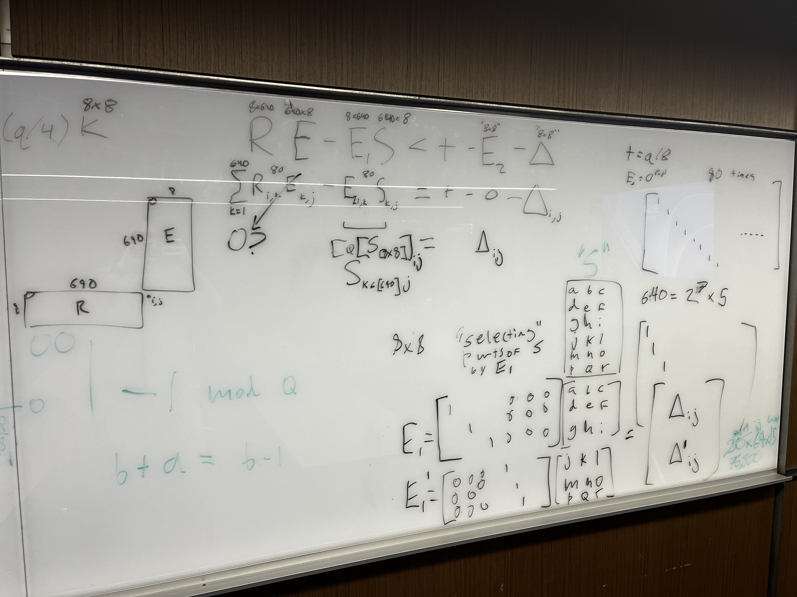
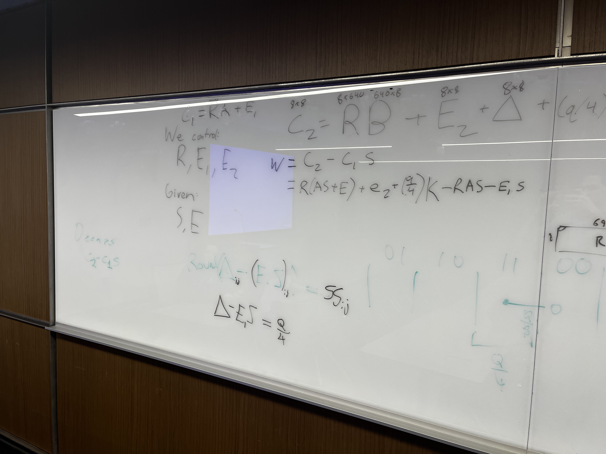
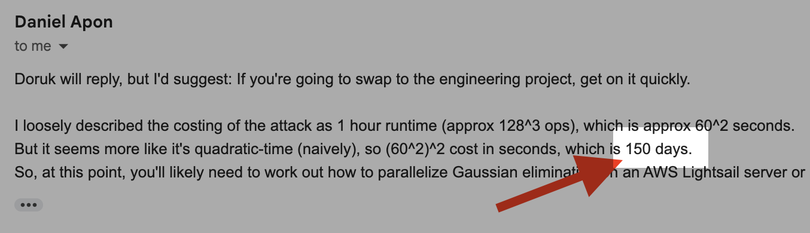
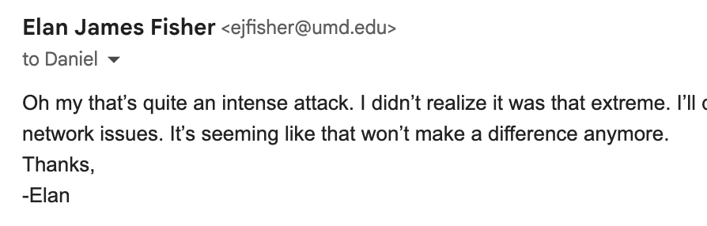
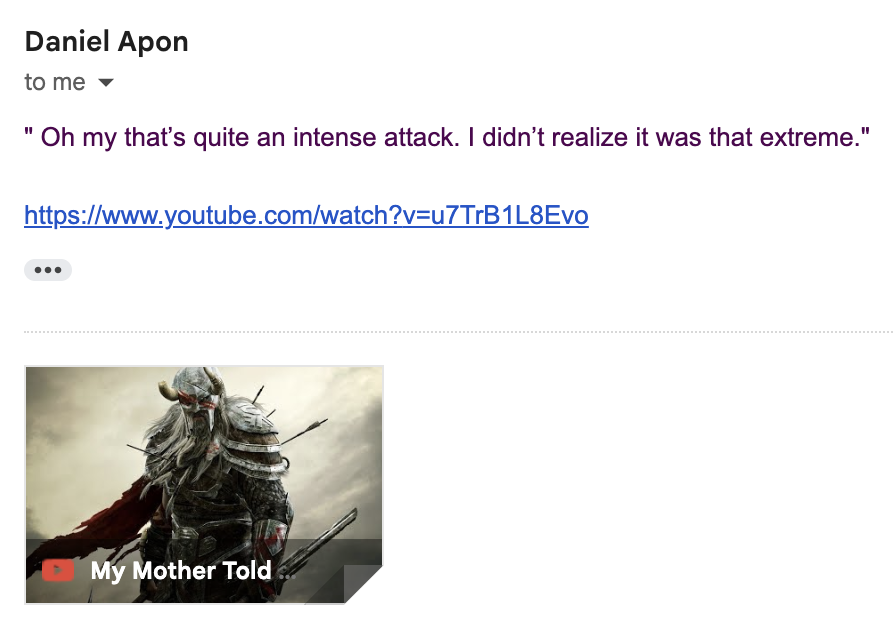
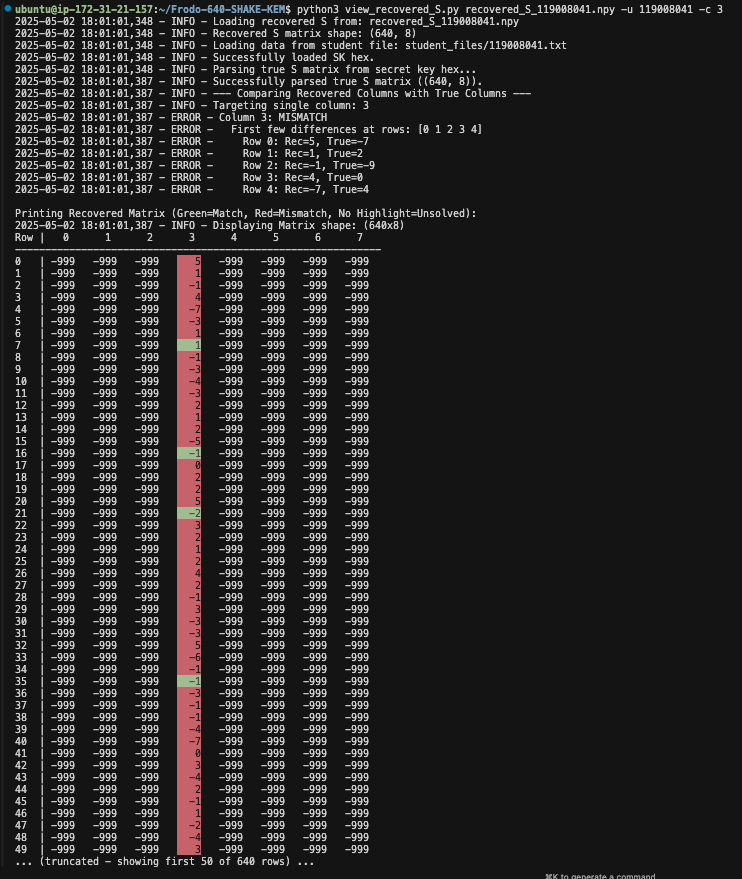
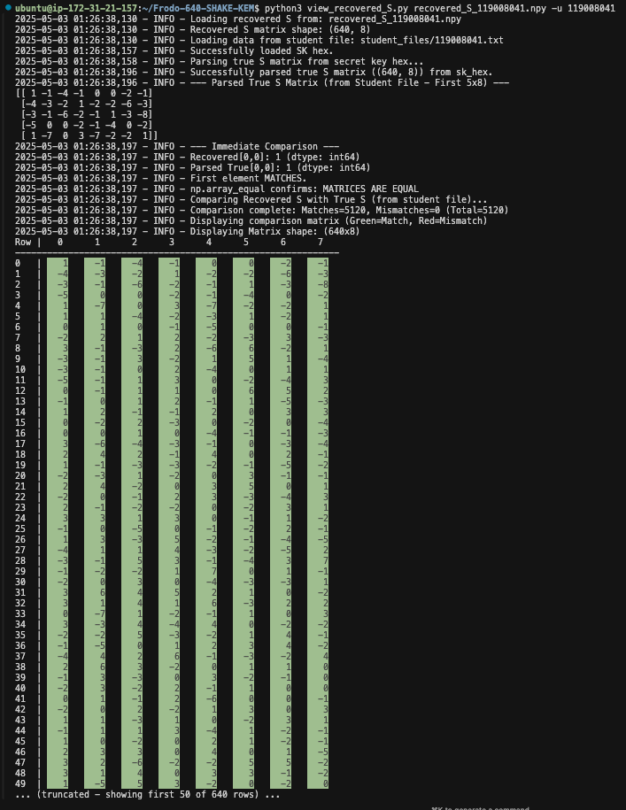
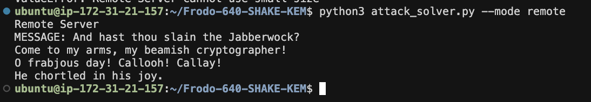

# FrodoKEM Attack Implementation - Spring 2025 - CMSC 656
## This attack cost us `$58.57`, and it was worth it!

## Authors *(and their contributions)*:
- Elan Fisher: *Compute infrastructure (AWS EC2) deployment, attack scaffolding, lattice factorization, verification*
- Benjamin Schreyer: *Core attack understanding and idea, initial research, attack code, small scale attack implementation*
- Daniel Kootz: *Local (oracle) and remote server interfaces, matrix operations*

## Overview *(How we did it)*:
We have attached our complete implementation of our attack against the FrodoKEM post-quantum key encapsulation mechanism. We have successfully (confirmed with TA and newly Dr., **Dr. Doruk** on 5/8/2025 after the attack ran) recovered the secret key through interaction with a decryption oracle. The attack was first developed and tested to be run locally on a small scale of the attack.

>We honestly could not have done it without the server code, thank you for making that available!

The [driver.py](./Frodo-640-SHAKE-KEM/driver.py) developed mostly by **Dan Kootz** was built to easily run locally only, remote only, and also with the option to run a `small` *(S = 32x4)* attack or `full` *(S = 840x8)* attack. To achieve this Dan wrote a driver to run the attack on a local instance of the server, and also to shim in the `small` and `full` attack sizes within [local_solver.py](./Frodo-640-SHAKE-KEM/local_server.py) all controlled with commandline args (kudos Kootz)! 

The full attack was performed using [attack_solver.py](./Frodo-640-SHAKE-KEM/attack_solver.py). You can see an annotated albeit non-functional version of this code in [ANNOTATED_attack_solver.py](./ANNOTATED_attack_solver.py) (Elan broke it when writing annotations while simulaneiously exploring runtime optimizations which ultimately broke it); this was written largely by **Elan**. It was constructed originally using `driver.py` as a base to interact with the local instance to produce a *valid enough* candidate `S` for the sole purpose to  perform the lattice factorization (`LLL`). It unintentionally ended up being close enough to being the full attack that it was tweaked slightly to ultimately do the full attack on the remote server.

Its original purpose was to run the function `solve_system_from_approximations()` which calls the script [solve_system_testing.py](/Frodo-640-SHAKE-KEM/solve_system_testing.py) which contains the lattice factorization code. Planning for lots of bugs, it was written to save any successful computations to disk with `.pkl` and `.npy` files. This proved to be a life saver when writing (and debugging) broken code as in its final form, on the beefy server, it takes ~15 mins given a full candidate `S`. 

Meanwhile, **Ben** and **Dan** worked on getting the candidate `S` and had tried a few methods for finding candidate *"equations"* (`S` matrices) so to speak using the binary search method. Here are some images of our preliminary attack plans:




The teams main insight, and the core to the attack, was noticing that `C1` and `C2` could be extremely sparse.

> Note: Our biggest success (other than the obvious recovery of S) was that we successfully split our tasks up by what we were each good at and wrote our code such such that we would only have to run the full attack one or two times total (prove in small case, test-fix-test-fix- ... -test-fix-test, scale up, and then repeat). 

Below is a snippet from our code which illustrates this where `C1` is all 0's except for one 1 in the entry we are trying to perform our delta search on:
```python
# c1_bytes = (000...[i,j=1]...000)
# c2_bytes = (000 ... 000)
# salt_to_use = (AAA ... AAA)
full_ct_bytes = c1_bytes + c2_bytes + salt_to_use
```

The solver code (and preliminary `S` approximation code) was deployed on an `AWS EC2` instance with 32 `vCores` and 64 GB (`c6i.8xlarge`) memory as we wanted to not waste any precious time waiting for broken code to run by **Elan**. Before the deployment we needed to answer if it was possible to do the LWE in parallel as this was our initial exchange...

We were not expecting the attack to be this intense and so,

and thats where we made the mistake,


We bought the AWS box as soon as possible. 

The lattice reduction solver used was from a python module [fpyll](https://github.com/fplll/fpylll) which is a wrapper for `fpylll` written in `c++`. It implements `BKZ`, `LLL`, and a few others. 
We found that in practice with, 
1. the full problem,
2. running locally (so that there is no connection latency or server rate limiting),
3. running in parallel (8 jobs, one for each column approximation),
4. and running on our server (32 cores, 64 GB mem),

that `BKZ` runs in about `~4 minutes` in parallel and `LLL` runs in ~13 seconds.

Within the attached code you can see the complete attack logs running on the remote and local. **Locally** the attack runs in total around `~12 minutes` as seen in [attack_solver_local_run.log](./Prrof_Of_Success/attack_solver_local_run.log)
> Finished gathering 5120/5120 approximations in 633.57s
is printed when the `S` approximation is finished (~10 mins) and is the majority of the attack and then the `LLL` solve takes (13.44s x 9).

Running on the remote we see a SIGNIFICANT drop in performance as seen in the log which got us the confirmed solve [attack_solver_elan_5_8_remote_full.log](./Prrof_Of_Success/attack_solver_elan_5_8_remote_full.log)
> Finished gathering 5120/5120 approximations in 13335.84s

which is `~3h 42 mins`, and the `LLL` took `~1m 7s` *(~13s x 8)*.
This is enough evidence that setting up and proving the attack locally was a good move.

Lastly we wrote a few scripts to verify and visualize our results, the following is a few of them. We needed a way to visualize if our recovered secret indeed did match the true secret so we wrote a visualizer. Also, note, we wrote the code to crack one column at a time to speed up dev significantly so this is the first attempt at cracking a column.


We were initially very wrong and there was a bug in the solver code. After much playing around and realizing that we were calling `fpylll` wrong we finally got our solver to recover `S`!


>NOTE: This is an old matrix and not the one from our solution on the server.

Green here is good, it means that that cell matches *exactly* with the true secrets cell.

Here is what our verification script which calls the third interface looked like on our end when we actually recovered the matrix, O frabjous day!

That felt pretty good to see.


---
## Table of Contents
1. [Project Structure (whats included)](#project-structure)
2. [Running the Attack](#running-the-attack)
4. [Core Code Broken Down](#core-code-broken-down)
3. [Resources Used](#resources)

## Project Structure
### Code
- `ANNOTATED_attack_solver.py`: Main attack implementation with detailed comments
- `solve_system_testing.py`: Lattice reduction solver for recovering the secret matrix
- `driver.py`: Orchestration script for running the attack
- `local_server.py`: Local implementation of the FrodoKEM server
- `remote_server.py`: Client for interacting with the remote FrodoKEM server
- `print_recovered_s.py`: Script to display recovered secret matrix
- `view_recovered_S.py`: Interactive viewer for comparing recovered and true secret matrices
- `Prrof_Of_Success/`: Directory containing evidence of successful attack
  - `full_s_may_8.txt`: Complete recovered secret matrix
  - `attack_solver_elan_5_8_remote_full.log`: Detailed attack execution log

## Running the Attack
1. How we ran the full attack (`tmux` is great):
```bash
tmux new-session -d 'python3 attack_solver.py --mode remote 2>&1 | tee attack_solver_elan_5_8_remote_2.log'
```

2. Confirming that we recovered the `S`:
```bash
python3 view_recovered_S.py recovered_S_116606028.npy -u 116606028
```

3. Dumping the full recovered `S`:
```bash
python3 print_recovered_s.py > full_s_may_8.txt
```

## Core Code Broken Down

### ANNOTATED_attack_solver.py
The main attack implementation that:
- Interacts with the FrodoKEM server
- Performs binary search to find rounding thresholds
- Recovers approximations of the secret matrix
- Coordinates the parallel recovery process
- Verifies the recovered solution

### solve_system_testing.py
Implements the lattice reduction attack:
- Uses LLL algorithm for lattice reduction
- Solves the LWE problem to recover the secret matrix
- Handles parallel processing of matrix columns
- Includes verification and error checking

### driver.py
Orchestrates the attack process:
- Manages server connections
- Handles key generation and encapsulation
- Coordinates the recovery process
- Provides command-line interface for attack configuration

## Server Components

### local_server.py
Implements a local FrodoKEM server for testing:
- Handles key generation
- Processes encapsulation requests
- Manages decryption oracle functionality
- Stores and retrieves key pairs

### remote_server.py
Client for interacting with the remote server:
- Manages HTTP requests to the remote API
- Handles JSON request/response formatting
- Implements all three server interfaces
- Provides error handling and logging

## Utility Scripts

### print_recovered_s.py
Utility for displaying recovered secrets:
- Loads and formats the recovered matrix
- Computes the final secret key
- Displays the complete solution

### view_recovered_S.py
Interactive comparison tool:
- Loads both recovered and true secret matrices
- Provides visual comparison with color coding
- Shows detailed mismatch information
- Supports partial matrix viewing

## Proof of Success
The `Prrof_Of_Success` directory contains:
- Complete recovered secret matrix
- Detailed execution logs
- Evidence of successful attack

## Resources
### Software and Libraries
- [Python wrapper for fplll](https://github.com/fplll/fpylll) - The FPLLL development team (2025). fpylll, a Python wrapper for the fplll lattice reduction library, Version: 0.6.3.

### Research Papers
- [FrodoKEM Specification](https://frodokem.org/files/FrodoKEM-specification-20171130.pdf)
- [When Frodo Flips: End-to-End Key Recovery on FrodoKEM via Rowhammer](https://dl.acm.org/doi/10.1145/3548606.3560673)
- [A Systematic Approach and Analysis of Key Mismatch Attacks on Lattice-Based NIST Candidate KEMs](https://eprint.iacr.org/2021/123)
- [Complete Attack on RLWE Key Exchange with reused keys, without Signal Leakage](https://eprint.iacr.org/2017/1185.pdf)

### AI Tools Used To Support Code Dev:
- [Gemini Pro 2.5](https://deepmind.google/technologies/gemini/) - Google DeepMind (2025). Large language model used for code analysis and optimization.
- [Cursor IDE](https://cursor.sh/) - Cursor AI (2025). AI-powered IDE used for code development and debugging.
